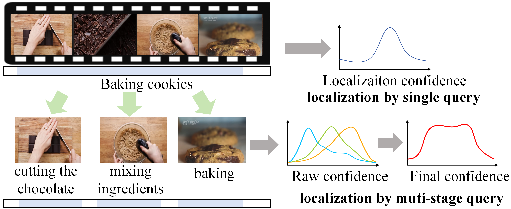
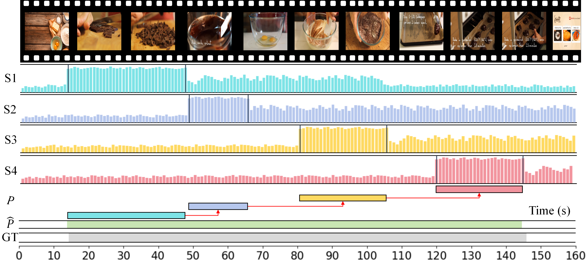

<div align="center">
  
# COLD

## Two-Stage Information Bottleneck For Temporal Language Grounding

*Official Implementation · ICME 2024*

---

**Haoyu Tang**<sup>1</sup> · **Shuaike Zhang**<sup>1</sup> · **Ming Yan**<sup>2</sup> · **Ji Zhang**<sup>2</sup> · **Mingzhu Xu**<sup>1 ✉</sup> · **Yupeng Hu**<sup>1 ✉</sup>· **Liqiang Nie**<sup>3 ✉</sup>

<sup>1</sup> School of Software, Shandong University &nbsp;|&nbsp;
<sup>2</sup> Alibaba Group &nbsp;|&nbsp;
<sup>3</sup> Harbin Institute of Technology (Shenzhen) &nbsp;|&nbsp;

✉ Corresponding author

---

<!-- Badges -->
[](https://ieeexplore.ieee.org/abstract/document/10687358)
[](https://ieeexplore.ieee.org/abstract/document/10687358)
[](https://github.com/iLearn-Lab/ICME24-COLD)
[](https://pytorch.org)
[](https://www.python.org)
[](./LICENSE)
[](https://github.com/iLearn-Lab/ICME24-COLD/stargazers)

---

<!-- Framework Figure -->


*Figure: Framework of our proposed COLD model. The pipeline consists of Feature Extraction → Cross-modal Highlight Information Bottleneck → Fusion Information Bottleneck → Boundary Prediction.*

</div>

---

## 📋 Table of Contents

- [Updates](#-updates)
- [Introduction](#-introduction)
- [Highlights](#-highlights)
- [Framework Overview](#-framework-overview)
- [Project Structure](#-project-structure)
- [Installation](#-installation)
- [Dataset](#-dataset--benchmark)
- [Usage](#-usage)
- [Main Results](#-main-results)
- [Visualization](#-visualization)
- [TODO](#-todo)
- [Citation](#-citation)
- [Acknowledgements](#-acknowledgements)
- [License](#-license)

---

## 🔥 Updates

- **[04/2026]** Initial release of code and paper.

---

## 📖 Introduction

Temporal Language Grounding (TLG) bridges the correspondence between natural language processing and computer vision, aiming to localize the most related video segment from a complex untrimmed video given a natural language query.

Existing cross-modal fusion methods often employ simple mathematical operations or attention mechanisms, which suffer from two critical issues:

1. The generated cross-modal embeddings are affected by noise in their unimodal representations.

2. The cross-modal representations contain many irrelevant redundancies, compromising the quality of cross-modal features and interfering with accurate moment localization.

To address these drawbacks, we propose a novel Cross-modaL information-constrained (COLD) model. Driven by the Information Bottleneck (IB) principle, our framework simultaneously maximizes the consistent mutual information between the language query and the target video moment, while learning a robust, compressed cross-modal representation devoid of irrelevant redundancies.

---

## ✨ Highlights

- 🏆 **Information-Theoretic Perspective**: We pioneer the application of the IB principle in TLG, presenting a novel COLD framework from an information-theoretic viewpoint.
- 🚀 **Two-Stage Bottleneck Design**: 1. CHIB (Cross-modal Highlight Information Bottleneck) filters unimodal noise and performs effective vision-language interaction modeling. 2. FIB (Fusion Information Bottleneck) eliminates redundancy and refines the cross-modal fused representation.
- 🧠 **Superior Performance**: COLD achieves new state-of-the-art performance on two standard benchmarks (TACoS and ActivityNet Captions), outperforming strong baselines like SeqPAN, EMB, and MSDETR.

---

## 🏗️ Framework Overview

CASCADE consists of four sequential modules:

| Step | Module | Description |
|------|--------|-------------|
| 1 | **Context-Guided Action Filtering** | MLLM identifies which actions from the predefined set actually occur in the video. |
| 2 | **Stage-Aware Decomposition** | MLLM generates a video-specific caption; LLM decomposes it into ordered key/non-key stages. |
| 3 | **Stage-wise Confidence Estimation** | MLLM computes frame-level confidence scores for each stage in a single batched forward pass. |
| 4 | **Compositional Action Reconstruction** | A hierarchical merging logic fuses stage segments into complete, coherent action instances. |



> *Figure: Illustration of stage-aware localization. Decomposing "Baking cookies" into sub-stages (cutting chocolate → mixing ingredients → baking) yields significantly more precise localization than a single-query approach.*

---

## 📁 Project Structure

```
AAAI26-CASCADE/
├── annotation/                        # Annotation files for datasets
│   ├── activity_net.v1-3.min.json     # ActivityNet-1.3 annotations
│   └── thumos_anno_action.json        # THUMOS14 annotations
├── code/                              # Core implementation of CASCADE
│   ├── 1category.py                   # Step 1: Context-Guided Action Filtering
│   ├── 2caption.py                    # Step 2: Video-specific caption generation
│   ├── 3stage.py                      # Step 3: Stage-Aware Decomposition (LLM)
│   ├── 4localization.py               # Step 4: Stage-wise Confidence Estimation
│   ├── 5merge.py                      # Step 5: Compositional Action Reconstruction
│   └── 6value.py                      # Step 6: Evaluation & metrics
├── paper/
│   ├── 29083.pdf                      # Paper PDF
│   ├── framework.png                  # Framework overview figure
│   ├── scores.png                     # Performance score visualization
│   └── video-stage.png                # Video stage decomposition illustration
├── LICENSE
└── README.md
```

---

## ⚙️ Installation

### Requirements

- Python >= 3.8
- PyTorch >= 2.0
- CUDA-compatible GPU (experiments run on NVIDIA A100 80GB)

### Setup

```bash
# Clone the repository
git clone https://github.com/iLearn-Lab/AAAI26-CASCADE.git
cd AAAI26-CASCADE

# Create a virtual environment (recommended)
conda create -n cascade python=3.10 -y
conda activate cascade

# Install dependencies
pip install -r requirements.txt
```

### Model Weights

CASCADE is training-free and relies on the following off-the-shelf pretrained models:

| Role | Model | Source |
|------|-------|--------|
| Backbone MLLM (option 1) | Qwen2.5-VL-7B | [HuggingFace](https://huggingface.co/Qwen/Qwen2.5-VL-7B-Instruct) |
| Backbone MLLM (option 2) | LLaVA-1.5-7B | [HuggingFace](https://huggingface.co/liuhaotian/llava-v1.5-7b) |
| Stage Decomposition LLM | DeepSeek-V3 | [DeepSeek API](https://platform.deepseek.com/) |

---

## 📊 Dataset / Benchmark

CASCADE is evaluated on two standard ZSTAL benchmarks:

**THUMOS14**
- 20 sports action classes, 200 training / 213 test videos.
- Evaluation at tIoU thresholds: {0.3, 0.4, 0.5, 0.6, 0.7}.

**ActivityNet-1.3**
- 200 action classes, ~20K videos across train/val/test splits.
- Evaluation at tIoU thresholds: {0.5, 0.75, 0.95}.

Both datasets are evaluated under **75%/25%** and **50%/50%** seen/unseen class splits, averaged over 10 random splits for statistical robustness.

Please refer to the official dataset pages for download instructions:
- [THUMOS14](http://crcv.ucf.edu/THUMOS14/)
- [ActivityNet-1.3](http://activity-net.org/)

---

## 🚀 Usage

### Inference

```bash
# Step 1 — Context-Guided Action Filtering
python code/1category.py --dataset activitynet --split 75_25

# Step 2 — Video-specific Caption Generation
python code/2caption.py --dataset activitynet --split 75_25

# Step 3 — Stage-Aware Decomposition (LLM)
python code/3stage.py --dataset activitynet --split 75_25

# Step 4 — Stage-wise Confidence Estimation
python code/4localization.py --dataset activitynet --backbone qwen --split 75_25

# Step 5 — Compositional Action Reconstruction
python code/5merge.py --dataset activitynet --split 75_25

# Step 6 — Evaluation
python code/6value.py --dataset activitynet --split 75_25
```

> ⚠️ **Note**: Detailed scripts and configuration files will be released shortly. Please check back or watch the repository for updates.

---

## 📈 Main Results

### THUMOS14

| Method | Training | 0.3 | 0.4 | 0.5 | 0.6 | 0.7 | mAP |
|--------|----------|-----|-----|-----|-----|-----|-----|
| Eff-Prompt | ✓ | 39.7 | 31.6 | 23.0 | 14.9 | 7.5 | 23.3 |
| STALE | ✓ | 40.5 | 32.3 | 23.5 | 15.3 | 7.6 | 23.8 |
| DeTAL | ✓ | 39.8 | 33.6 | 25.9 | 17.4 | 9.9 | 25.3 |
| T3AL | ✗ | 19.2 | 12.7 | 7.4 | 4.4 | 2.2 | 9.2 |
| FreeZAD | ✗ | 21.2 | 13.6 | 8.3 | 4.7 | 2.5 | 10.0 |
| ZEAL | ✗ | 22.1 | 16.1 | 11.0 | 5.7 | 3.0 | 11.6 |
| **CASCADE-Qwen (Ours)** | ✗ | 23.9 | 17.5 | 11.7 | 7.6 | 4.3 | **13.0** |
| **CASCADE-LLaVA (Ours)** | ✗ | 23.8 | 17.9 | 14.0 | 7.6 | 5.1 | **13.7** |

*Results under the 75%/25% split. Training-free methods in **bold**.*

### ActivityNet-1.3

| Method | Training | 0.5 | 0.75 | 0.95 | mAP |
|--------|----------|-----|------|------|-----|
| DeTAL | ✓ | 39.3 | 26.4 | 5.0 | 25.8 |
| FreeZAD | ✗ | 33.5 | 17.5 | 3.9 | 18.3 |
| **CASCADE-Qwen (Ours)** | ✗ | 41.4 | 27.4 | 7.1 | **25.3** |
| **CASCADE-LLaVA (Ours)** | ✗ | 52.7 | 36.7 | 8.3 | **32.6** |

*Results under the 75%/25% split. CASCADE-LLaVA surpasses ALL training-based competitors.*



---

## 🎨 Visualization

The figure below shows CASCADE's localization process for the action "Baking cookies" on ActivityNet-1.3. The action is decomposed into four semantic stages (S1: Preparing Ingredients, S2: Mixing Ingredients, S3: Melting Chocolate, S4: Baking). Frame-level confidence scores are computed per stage, thresholded to yield raw proposals (P), and then fused via hierarchical merging into a final prediction (P̂) that closely matches the ground truth (GT).


---

## ✅ TODO

- [ ] Release full inference code
- [ ] Release detailed configuration files and prompts
- [ ] Release annotation files
- [ ] Add demo / visualization script
- [ ] Release pre-computed results

---

## 📝 Citation

If you find CASCADE useful in your research, please consider citing our paper:

```bibtex
@inproceedings{tang2026cascade,
  title     = {Decompose and Conquer: Compositional Reasoning for Zero-Shot Temporal Action Localization},
  author    = {Tang, Haoyu and Liang, Tianyuan and Jiang, Han and Liu, Xuesong and Zheng, Qinghai and Hu, Yupeng},
  booktitle = {Proceedings of the AAAI Conference on Artificial Intelligence},
  year      = {2026}
}
```

---

## 🙏 Acknowledgements

This work was supported in part by the National Natural Science Foundation of China (No. 62206156, No. 62306074, No. 62276155, No. 72004127, No. 62206157); the NSF of Shandong Province (No. ZR2024QF104, No. ZR2021MF040, No. ZR2022QF047); the Key R&D Program of Shandong Province (No. 2022CXGC020107); the Natural Science Basic Research Plan in Shaanxi Province (No. 2025JCJCQN-091); and the Key R&D Program of Shaanxi (No. 2024GX-YBXM-556).

---

## 📄 License

This project is released under the terms of the [LICENSE](./LICENSE) file included in this repository.
