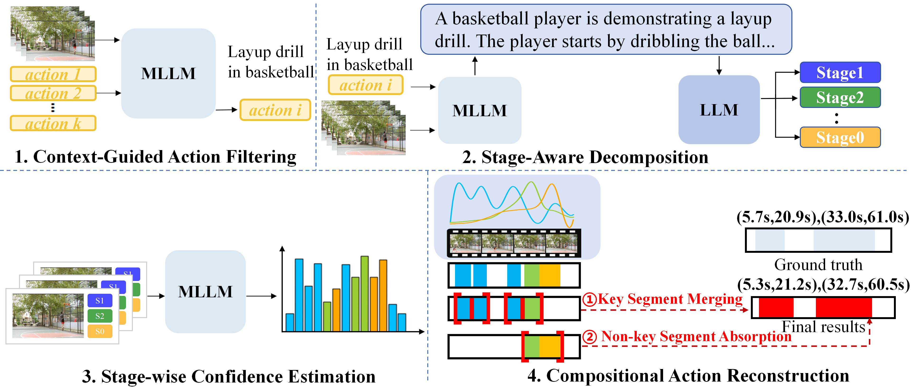

<div align="center">
  
# 🎬 COLD

## Two-Stage Information Bottleneck For Temporal Language Grounding

*Official Implementation · ICME 2024*

---

**Haoyu Tang**<sup>1</sup> · **Shuaike Zhang**<sup>1</sup> · **Ming Yan**<sup>2</sup> · **Ji Zhang**<sup>2</sup> · **Mingzhu Xu**<sup>1 ✉</sup> · **Yupeng Hu**<sup>1 ✉</sup>· **Liqiang Nie**<sup>3 ✉</sup>

<sup>1</sup> School of Software, Shandong University &nbsp;|&nbsp;
<sup>2</sup> Alibaba Group &nbsp;|&nbsp;
<sup>3</sup> Harbin Institute of Technology (Shenzhen) &nbsp;|&nbsp;

✉ Corresponding author

---

<!-- Badges -->
[](https://ieeexplore.ieee.org/abstract/document/10687358)
[](https://ieeexplore.ieee.org/abstract/document/10687358)
[](https://github.com/iLearn-Lab/ICME24-COLD)
[](https://pytorch.org)
[](https://www.python.org)
[](./LICENSE)
[](https://github.com/iLearn-Lab/ICME24-COLD/stargazers)

---

<!-- Framework Figure -->



*Figure: Framework of our proposed COLD model. The pipeline consists of Feature Extraction → Cross-modal Highlight Information Bottleneck → Fusion Information Bottleneck → Boundary Prediction.*

</div>

---

## 📋 Table of Contents

- [Updates](#-updates)
- [Introduction](#-introduction)
- [Highlights](#-highlights)
- [Framework Overview](#-framework-overview)
- [Project Structure](#-project-structure)
- [Installation](#-installation)
- [Dataset](#-dataset--benchmark)
- [Usage](#-usage)
- [Main Results](#-main-results)
- [Visualization](#-visualization)
- [TODO](#-todo)
- [Citation](#-citation)
- [Acknowledgements](#-acknowledgements)
- [License](#-license)

---

## 🔥 Updates

- **[04/2026]** Initial release of code and paper.

---

## 📖 Introduction

Temporal Language Grounding (TLG) bridges the correspondence between natural language processing and computer vision, aiming to localize the most related video segment from a complex untrimmed video given a natural language query.

Existing cross-modal fusion methods often employ simple mathematical operations or attention mechanisms, which suffer from two critical issues: 1. The generated cross-modal embeddings are affected by noise in their unimodal representations. 2. The cross-modal representations contain many irrelevant redundancies, compromising the quality of cross-modal features and interfering with accurate moment localization.

To address these drawbacks, we propose a novel Cross-modaL information-constrained (COLD) model. Driven by the Information Bottleneck (IB) principle, our framework simultaneously maximizes the consistent mutual information between the language query and the target video moment, while learning a robust, compressed cross-modal representation devoid of irrelevant redundancies.

---

## ✨ Highlights

- 🏆 **Information-Theoretic Perspective**: We pioneer the application of the IB principle in TLG, presenting a novel COLD framework from an information-theoretic viewpoint.
- 🚀 **Two-Stage Bottleneck Design**: 1. CHIB (Cross-modal Highlight Information Bottleneck) filters unimodal noise and performs effective vision-language interaction modeling. 2. FIB (Fusion Information Bottleneck) eliminates redundancy and refines the cross-modal fused representation.
- 🧠 **Superior Performance**: COLD achieves new state-of-the-art performance on two standard benchmarks (TACoS and ActivityNet Captions), outperforming strong baselines like SeqPAN, EMB, and MSDETR.

---

## 🏗️ Framework Overview

The COLD framework executes through four sequential modules:

| Step | Module | Description |
|------|--------|-------------|
| 1 | **Feature Extraction** | Encodes video frames and language queries using pretrained extractors (I3D, GloVe), followed by intra-modal enhancement and frame-by-word attention. |
| 2 | **Cross-modal Highlight Information Bottleneck** | Maximizes mutual information between the query and highlighted frames of the target moment to filter out uni-modal noise. |
| 3 | **Fusion Information Bottleneck** | Learns a minimally sufficient latent cross-modal representation that retains only the information relevant to the localization target. |
| 4 | **Boundary Prediction** | Estimates frame-level probabilities to predict the start and end boundaries of the target video moment. |

---

## 📁 Project Structure

```
ICME24-COLD/
├── annotation/                        # Annotation files for datasets
│   ├── activity_net.v1-3.min.json     # ActivityNet-1.3 annotations
│   └── thumos_anno_action.json        # THUMOS14 annotations
├── code/                              # Core implementation of COLD
│   ├── 1category.py                   # Step 1: Context-Guided Action Filtering
│   ├── 2caption.py                    # Step 2: Video-specific caption generation
│   ├── 3stage.py                      # Step 3: Stage-Aware Decomposition (LLM)
│   ├── 4localization.py               # Step 4: Stage-wise Confidence Estimation
│   ├── 5merge.py                      # Step 5: Compositional Action Reconstruction
│   └── 6value.py                      # Step 6: Evaluation & metrics
├── paper/
│   ├── 29083.pdf                      # Paper PDF
│   ├── framework.png                  # Framework overview figure
│   ├── scores.png                     # Performance score visualization
│   └── video-stage.png                # Video stage decomposition illustration
├── LICENSE
└── README.md
```

---

## ⚙️ Installation

### Requirements

- Python >= 3.8
- PyTorch >= 2.0
- CUDA-compatible GPU (experiments run on NVIDIA A100 80GB)

### Setup

```bash
# Clone the repository
git clone https://github.com/iLearn-Lab/ICME24-COLD.git
cd ICME24-COLD

# Create a virtual environment (recommended)
conda create -n cold python=3.10 -y
conda activate cold

# Install dependencies
pip install -r requirements.txt
```

## 📊 Dataset / Benchmark

COLD is evaluated on two standard ZSTAL benchmarks:

**TACoS**
- Focuses on cooking activities.
- Evaluation metrics: R@1, IoU={0.3, 0.5, 0.7} and mIoU.

**ActivityNet Captions**
- Contains diverse open-domain videos.
- Evaluation metrics: R@1, IoU={0.3, 0.5} and mIoU.

Please refer to the official dataset pages for download instructions:
- [TACoS](http://crcv.ucf.edu/THUMOS14/)
- [ActivityNet Captions](http://activity-net.org/)

---

## 📈 Main Results


**


---


---

## ✅ TODO

- [ ] Release full inference code
- [ ] Release detailed configuration files and prompts
- [ ] Release annotation files
- [ ] Add demo / visualization script
- [ ] Release pre-computed results

---

## 📝 Citation

If you find COLD useful in your research, please consider citing our paper:

```bibtex
@inproceedings{tang2024cold,
  title     = {Two-Stage Information Bottleneck for Temporal Language Grounding},
  author    = {Tang, Haoyu and Zhang, Shuaike and Yan, Ming and Zhang, Ji and Xu, Mingzhu and Hu, Yupeng and Nie, Liqiang},
  booktitle = {2024 IEEE International Conference on Multimedia and Expo (ICME)},
  pages     = {1--6},
  year      = {2024},
  organization = {IEEE},
  doi       = {10.1109/ICME57554.2024.10687358}
}
```

---

## 🙏 Acknowledgements

This work was supported in part by the Alibaba Group through Alibaba Innovative Research Program, No.21169774; in part by the National Natural Science Foundation (NSF) of China, No.62206156, No.62276155, No.72004127, and No.62206157; in part by the NSF of Shandong Province, No.ZR2021MF040 and No.ZR2022QF047; and in part by the Key R&D Program of Shandong Province, China (Major Scientific and Technological Innovation Projects), No.2022CXGC020107.

---

## 📄 License

This project is released under the terms of the [LICENSE](./LICENSE) file included in this repository.
